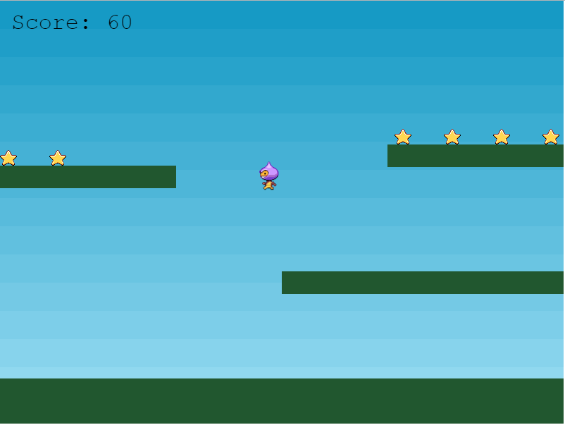

# Phaser3

[官方文档](http://phaser.io/tutorials/making-your-first-phaser-3-game-chinese/index)

```html
Phaser3官方介绍:
  Phaser是一个快速，免费且有趣的开源HTML5游戏框架，可在台式机和移动Web浏览器上提供WebGL和Canvas渲染。
  可以使用第三方工具将游戏编译为iOS，Android和本机应用程序。您可以使用JavaScript或TypeScript进行开发。
```

+ 查看对应文档
  + [整体大局配置](./part1.html)
  + [预加载](./part2.html)
  + [create](./part3.html)
  + [platforms](./part4.html)
  + [player](./part5.html)
  + [collider](./part6.html)
  + [update](./part7.html)
  + [overlap](./part8.html)
  + [score](./part9.html)
  + [gameOver](./part10.html)

最后效果~不多说上图(200行代码就能实现！)


## last

```html
由于似乎是开发不久的。。还没有找到官方比较详细的API文档深入学习
期待ing...
```
